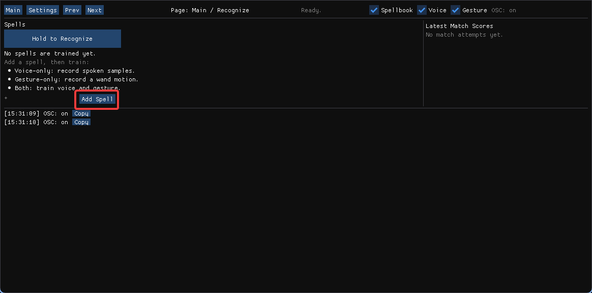
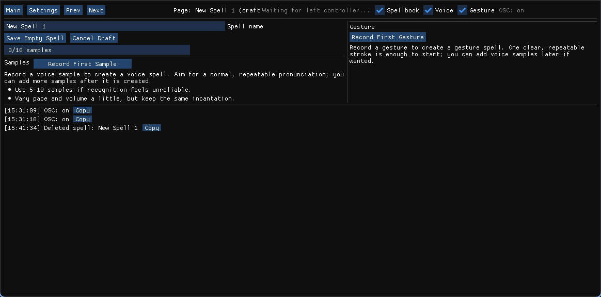
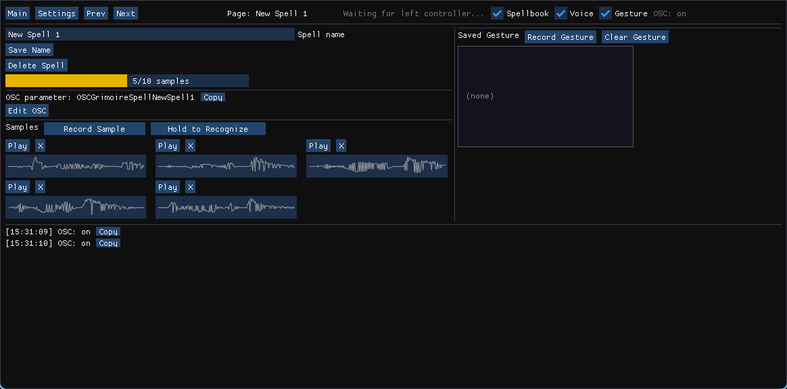
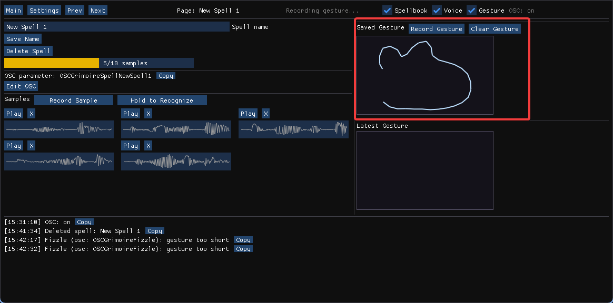
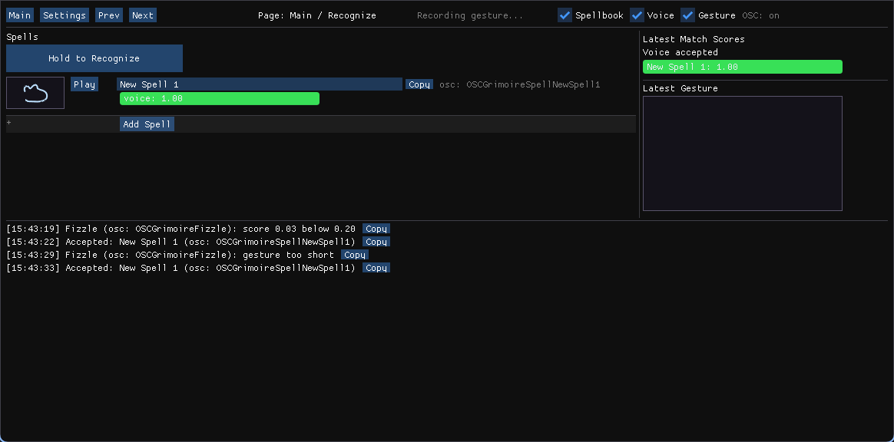
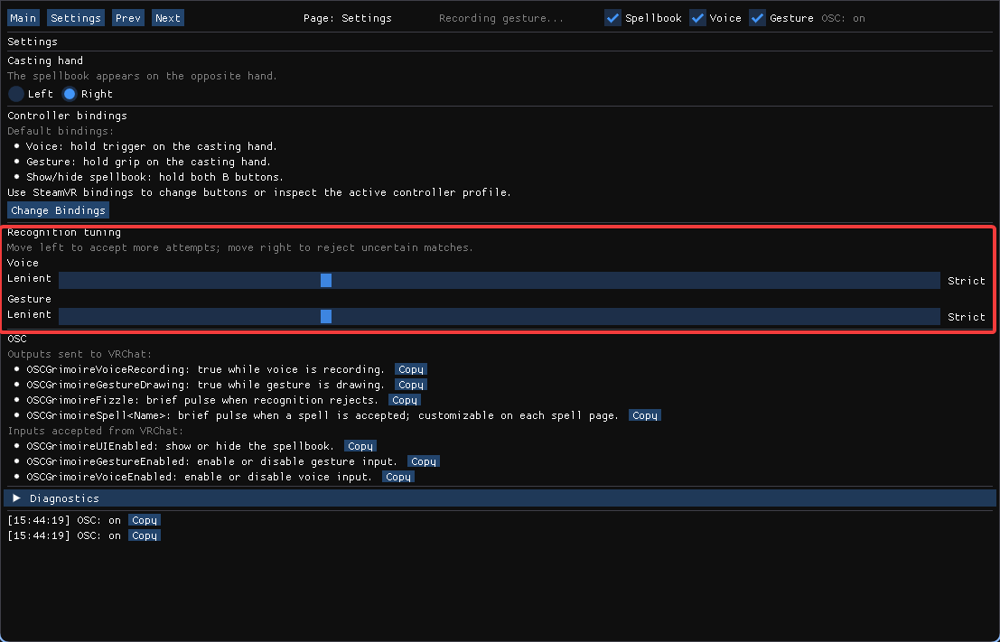

# OSC Grimoire (WIP)

Do wizard stuff in vrchat with verbal and somatic components.

## Install

Download the latest Windows zip from the
[GitHub releases page](https://github.com/hiinaspace/osc-grimoire/releases), unzip
it somewhere convenient (it's portable).

## Tutorial

### 1. Open the app

Launch `osc-grimoire-overlay.exe`. It'll take a few seconds to load the voice recognition model. Then you should see the UI:



If SteamVR is already running, OSC Grimoire opens both a desktop control window
and a VR spellbook overlay floating over your off-hand (left by default). You can click buttons with the right controller as laser pointer.

If SteamVR is not running, it starts in desktop-only
mode so you can train/test voice without booting VR. press `Start Overlay`
when you want to bring up SteamVR.

### 2. Add a spell

Click `Add Spell`. A new draft spell page opens. The default name is
`New Spell N`; you can rename it now or after training.



### 3. Train the voice incantation

Hold `Record First Sample` and say the spell clearly. Release the button when
you finish speaking. After the first sample, the draft becomes a saved spell.

Record several more samples with `Record Sample`. Five to ten samples is a good
starting point. Keep the word mostly consistent, but vary your pace and volume a
little so recognition is not too brittle.

Use `Hold to Recognize` on the desktop spell page to test the incantation
without entering VR.



### 4. Train the wand gesture

On the spell page, click `Record / Replace Gesture`. In VR, hold the casting-hand
grip button, draw the gesture, then release grip. The saved gesture preview appears on the page.

You can replace the gesture at any time by pressing `Record / Replace Gesture`
again. Use `Clear Gesture` if you want the spell to be voice-only.



### 5. Cast in VR

By default:

- Voice: hold trigger on the casting hand, speak, then release.
- Gesture: hold grip on the casting hand, draw, then release.
- Spellbook visibility: hold both B buttons.

Successful voice and gesture recognition will emit a boolean parameter pulse over OSC. You can copy the exact parameter name from the desktop UI to use in your avatar animators in VRChat. Spells can also use a custom parameter name if you want to drive a preexisting prefab.



## QA

### How do I customize the VRChat avatar parameter for a spell?

Open the spell page and edit `OSC parameter`. Leave it blank to use the default
generated name, or enter the exact avatar parameter name you want to pulse.

The default is:

```
OSCGrimoireSpell<SpellName>
```

For example, `Alohomora` becomes `OSCGrimoireSpellAlohomora`. The desktop UI has
`Copy` buttons beside OSC names so you can paste them into Unity.

### Which OSC parameters does the app send?

Outputs sent to VRChat:

- `OSCGrimoireVoiceRecording`: true while voice recording is active.
- `OSCGrimoireGestureDrawing`: true while gesture drawing is active.
- `OSCGrimoireFizzle`: short pulse when recognition rejects.
- `OSCGrimoireSpell<Name>`: short pulse when a spell is accepted, unless the
  spell has a custom OSC parameter.

Inputs accepted from VRChat:

- `OSCGrimoireUIEnabled`: show or hide the spellbook.
- `OSCGrimoireGestureEnabled`: enable or disable gesture input.
- `OSCGrimoireVoiceEnabled`: enable or disable voice input.

These are useful for avatar menu toggles.

### The recognition is too easy/too hard, how do I change it?

Open `Settings`. The `Voice` and `Gesture` sliders move from `Lenient` to
`Strict`.

- Move left if real casts are being rejected too often.
- Move right if random sounds or sloppy gestures are accepted too often.

The defaults are intentionally somewhat lenient so the system feels responsive.

If the recognition is still too hard at low strictness, you may just have to
record more samples and/or choose a different spell word.



### How do I change controller bindings?

Open `Settings`, then click `Change Bindings`. SteamVR opens the binding UI for
OSC Grimoire.

Default bindings:

- Voice: hold trigger on the casting hand.
- Gesture: hold grip on the casting hand.
- Show/hide spellbook: hold both B buttons.

### How do I change casting hand?

Open `Settings` and choose `Left` or `Right` under `Casting hand`. The spellbook
appears on the opposite hand.

### Can I use only voice or only gesture?

Yes. A spell can have voice samples, a gesture, or both. Train only the parts you
want. Use `Clear Gesture` to remove a gesture from an existing spell.

### Why did my spell fizzle?

A fizzle means the latest voice or gesture attempt did not pass the current
thresholds. Common fixes:

- Add more voice samples for the same spell.
- Re-record unclear or inconsistent samples.
- Make gestures more distinct from each other.
- Move the relevant strictness slider slightly toward `Lenient`.

### Where is my spellbook saved?

By default, release builds store data in AppData. Dev
runs can use an explicit directory:

```
uv run osc-grimoire-overlay --data-dir ./data
```

### Can you share spellbooks?

In theory you can copy and paste the data directory from somebody else. I'm not sure how well the voice samples generalize though; it's probably faster to re-record them yourself.

### How does the recognition work?

The voice recognition uses the [`entropora/parakeet-ctc-110m-int8`](https://huggingface.co/entropora/parakeet-ctc-110m-int8) ASR model. However, instead of using its final transcription verbatim and matching text, we match against audio samples you record.

For each sample, the model produces frame-by-frame CTC token probabilities, and the app collapses those into a token sequence for that sample. When you speak a query, the app scores how likely the query's CTC probabilities are to emit each recorded sample's token sequence, allowing CTC's timing-flexible alignment. The spell whose samples score best wins, subject to the strictness thresholds. This seems to work more robustly for the out-of-distribution nonsense words you'd want for spells, where exact transcription text can be too sensitive to alternate renderings like "aloha mora" for "alohomora". See [the investigation notes](./docs/INVESTIGATION.md) for more details on how I got here.

The gesture recognition is the [$Q recognizer](https://depts.washington.edu/acelab/proj/dollar/qdollar.html) on a projected version of your controller position.

### Didst thou consort with demons to make this?

I am the bone of my slop, etc, etc

## Dev info

### Local release build

Windows release builds are PyInstaller `onedir` bundles with the
`entropora/parakeet-ctc-110m-int8` ONNX model included locally.

```
uv sync --group build
.\scripts\build_release.ps1
```

The build writes `dist\osc-grimoire-windows.zip`. The unpacked executable is
`dist\osc-grimoire\osc-grimoire-overlay.exe`.

### GitHub release build

Pushing a `v*` tag runs the Windows release workflow, uploads the zip artifact,
and creates or updates the matching GitHub release:

```
git tag v0.1.0
git push origin v0.1.0
```

The workflow can also be run manually from GitHub Actions to produce a build
artifact without publishing a release.
