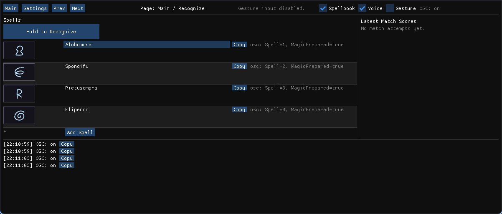
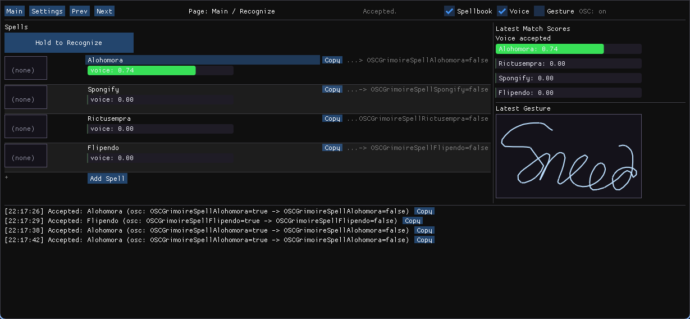
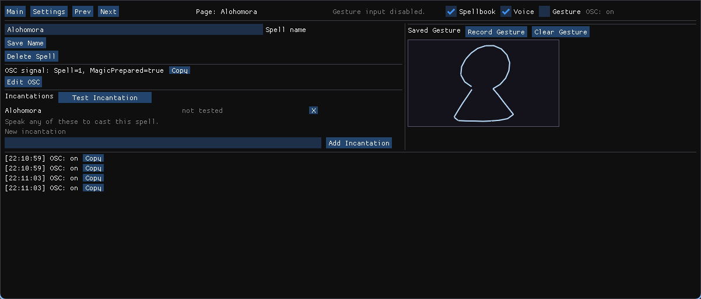
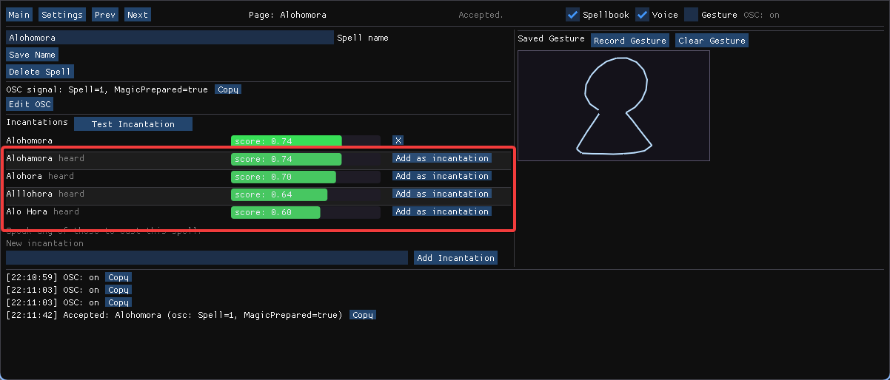
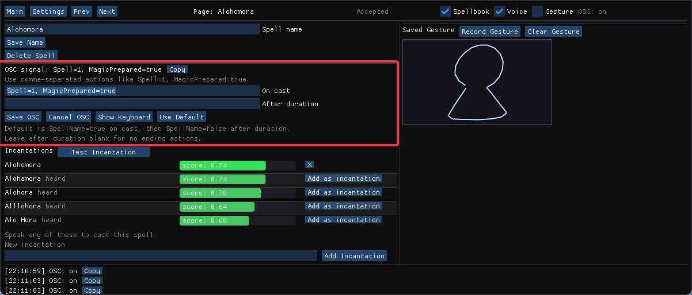
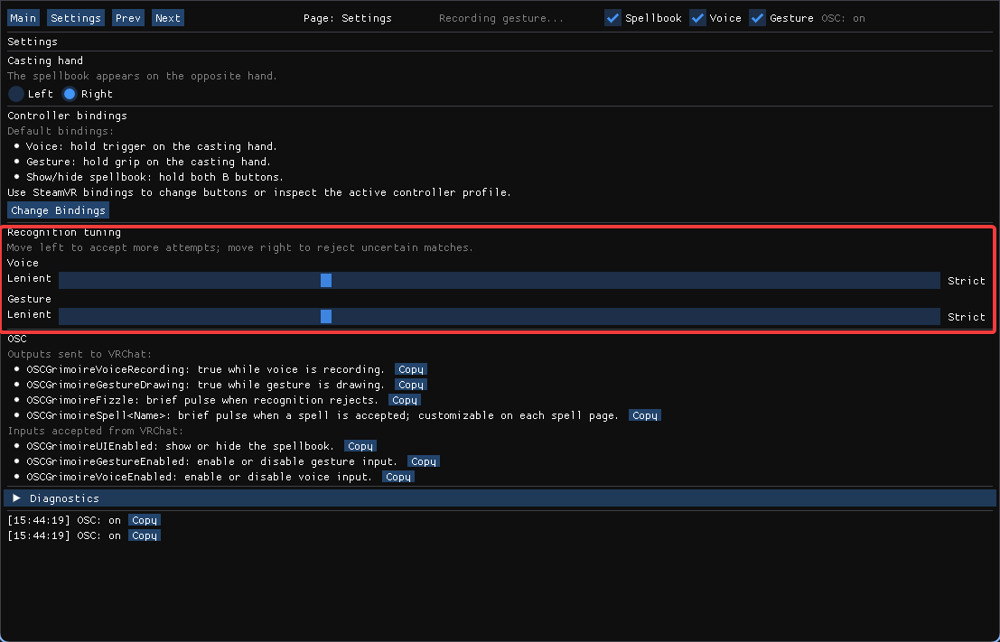

# OSC Grimoire

Send OSC parameters to your avatar in vrchat with your voice or a gesture. Tuned for spellcasting. Even nonsense words other speech recognition systems won't recognize should work.

## Install

Download the latest Windows zip from the
[GitHub releases page](https://github.com/hiinaspace/osc-grimoire/releases), unzip
it somewhere convenient (it's portable).

## Tutorial

### 1. Open the app

Launch `osc-grimoire-overlay.exe`. It'll take a few seconds to load the voice recognition model. Then you should see the UI:



If SteamVR is already running, OSC Grimoire opens both a desktop control window
and a VR spellbook overlay floating over your off-hand (left by default). You can click buttons with the right controller as laser pointer.

If SteamVR is not running, it starts in desktop-only
mode so you can test voice without booting VR. Press `Start Overlay`
when you want to bring up SteamVR.

### 2. Use a spell

New spellbooks start with `Alohomora`, `Spongify`, `Rictusempra`, and
`Flipendo` so sample avatars can work immediately.

Hold down trigger, speak the name of a spell. If you spoke it right, you'll see it recognized with a green bar:



### 3. Edit a spell

If you click on a spell, you can edit the incantations used to speak it, an optional gesture, the OSC parameters sent, and the spell name.



Voice recognition is text-first. A spell name is the display/OSC name; its
incantations are the phrases you can speak to cast that spell.

Use `Test Incantation` on the spell page to try one. The incantation table shows
scores for saved incantations and likely heard phrases. Add a heard phrase as an
incantation if it consistently scores better for your pronunciation.



A spell with no incantations will not match voice input. Use `Add spell name as
incantation`, type a phrase, or add one from a heard phrase row to make it
voice-castable.

Use `Speak Name` when editing a spell name if you want to fill it from your
pronunciation.


### 4. Train the wand gesture

On the spell page, click `Record / Replace Gesture`. In VR, hold the casting-hand
grip button, draw the gesture, then release grip. The saved gesture preview appears on the page.

You can replace the gesture at any time by pressing `Record / Replace Gesture`
again. Use `Clear Gesture` if you want the spell to be voice-only.

## QA

### How do I customize the VRChat avatar parameter for a spell?

Open the spell page and edit `OSC signal`. The default signal uses:

```
OSCGrimoireSpell<SpellName>
```

For example, `Alohomora` becomes `OSCGrimoireSpellAlohomora`. The desktop UI has
`Copy` buttons beside OSC names so you can paste them into Unity.

Custom signals use comma-separated `parameter=value` actions:

- `On cast`: sent immediately when the spell is accepted.
- `After duration`: sent after the configured pulse length.

For example, the default bool pulse is equivalent to:

```text
On cast: OSCGrimoireSpellAlohomora=true
After duration: OSCGrimoireSpellAlohomora=false
```

For an avatar that uses a stable shared int and a separate preparation bool:

```text
On cast: Spell=1, MagicPrepared=true
After duration:
```



### Which OSC parameters does the app send?

Outputs sent to VRChat:

- `OSCGrimoireVoiceRecording`: true while voice recording is active.
- `OSCGrimoireGestureDrawing`: true while gesture drawing is active.
- `OSCGrimoireFizzle`: short pulse when recognition rejects.
- `OSCGrimoireSpell<Name>`: default bool pulse when a spell is accepted, unless
  the spell has a custom OSC signal.

Inputs accepted from VRChat:

- `OSCGrimoireUIEnabled`: show or hide the spellbook.
- `OSCGrimoireGestureEnabled`: enable or disable gesture input.
- `OSCGrimoireVoiceEnabled`: enable or disable voice input.

These are useful for avatar menu toggles.

### The recognition is too easy/too hard, how do I change it?

Open `Settings`. The `Voice` and `Gesture` sliders move from `Lenient` to
`Strict`.

- Move left if real casts are being rejected too often.
- Move right if random sounds or sloppy gestures are accepted too often.

The defaults are intentionally somewhat lenient so the system feels responsive.

If the recognition is still too hard at low strictness, add an incantation from
the heard phrase list or choose a more distinct spell word.



### How do I change controller bindings?

Open `Settings`, then click `Change Bindings`. SteamVR opens the binding UI for
OSC Grimoire.

Default bindings:

- Voice: hold trigger on the casting hand.
- Gesture: hold grip on the casting hand.
- Show/hide spellbook: hold both B buttons.

### How do I change casting hand?

Open `Settings` and choose `Left` or `Right` under `Casting hand`. The spellbook
appears on the opposite hand.

### Can I use only voice or only gesture?

Yes. A spell can have incantations, a gesture, or both. Use `Clear Gesture` to
remove a gesture from an existing spell.

### Why did my spell fizzle?

A fizzle means the latest voice or gesture attempt did not pass the current
thresholds. Common fixes:

- Add a clearer alternate spelling or phrase as an incantation.
- Add an incantation from the heard phrase list.
- Edit the spell name if the written form does not match your pronunciation.
- Make gestures more distinct from each other.
- Move the relevant strictness slider slightly toward `Lenient`.

### Where is my spellbook saved?

In `C:\Users\<your username>\AppData\Roaming\osc-grimoire\spellbook.json`

### Can you share spellbooks?

Yeah, you can copy and paste the spellbook.json.

### How does the recognition work?

The voice recognition uses the [`entropora/parakeet-ctc-110m-int8`](https://huggingface.co/entropora/parakeet-ctc-110m-int8) ASR model.

Each incantation is tokenized with Parakeet's `vocab.txt`. When you speak, the
app turns the audio into CTC token log probabilities, then forced-scores every
enabled incantation against that query. Lower distance means the audio is more
likely to emit that exact token sequence.

For each spell, the best-scoring incantation becomes that spell's voice score.
The app accepts the best spell only if:

- its best incantation distance is under the current absolute threshold; and
- it is far enough ahead of the second-best spell by relative margin.

The `Voice` strictness slider adjusts both gates. The spell page also shows top
CTC phrase hypotheses from the same query audio as pending incantations, with the
score they would get if added. See [the investigation notes](./docs/INVESTIGATION.md)
for more detail.

The gesture recognition is the [$Q recognizer](https://depts.washington.edu/acelab/proj/dollar/qdollar.html) on a projected version of your controller position.

### How is this different than just matching the speech-to-text (STT) output?

Usually you use STT by taking the most likely token sequence the model spits out. If you're trying to match low-probability nonsense incantations though, it's very hard to convince the model your particular spelling is the most likely. However, the individual tokens that make up the word usually are fairly probable. So going "underneath" the final output and matching against the token log probabilities tends to work a lot better.

### Didst thou consort with demons to make this?

I am the bone of my slop, etc, etc

## Dev info

### Local release build

Windows release builds are PyInstaller `onedir` bundles with the
`entropora/parakeet-ctc-110m-int8` ONNX model included locally.

```
uv sync --group build
.\scripts\build_release.ps1
```

The build writes `dist\osc-grimoire-windows.zip`. The unpacked executable is
`dist\osc-grimoire\osc-grimoire-overlay.exe`.

### GitHub release build

Pushing a `v*` tag runs the Windows release workflow, uploads the zip artifact,
and creates or updates the matching GitHub release:

```
git tag v0.1.0
git push origin v0.1.0
```

The workflow can also be run manually from GitHub Actions to produce a build
artifact without publishing a release.
